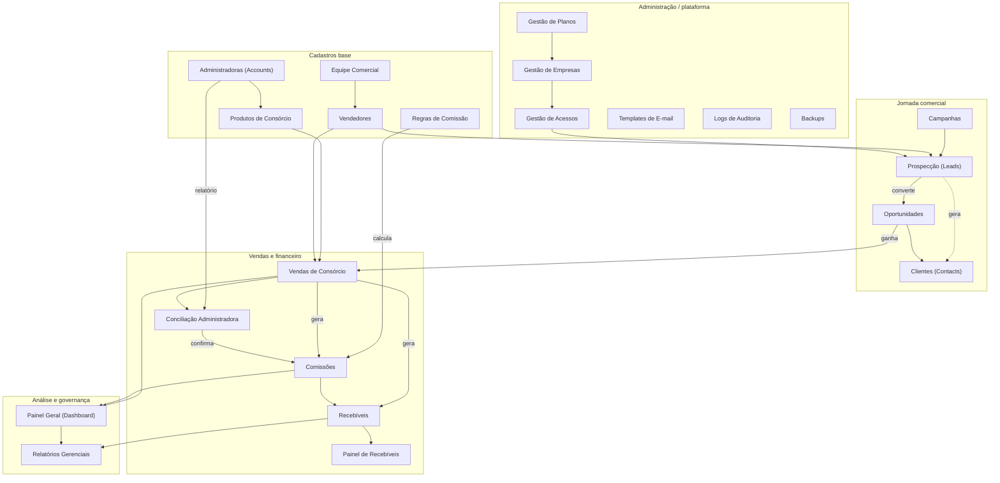

# NVION CRM — Documentação de Módulos

Este documento explica **cada módulo** da plataforma: o que faz, como funciona,
suas premissas e **como os módulos se interagem**. É a referência funcional do
NVION — complementa o [README](../README.md) (visão geral) e o
[roadmap](NVION_ROADMAP.md) (etapas/futuro).

---

## 1. Premissas gerais

Antes dos módulos, os princípios que valem para toda a plataforma:

1. **Multi-tenant por empresa.** Todo registro pertence a uma empresa
   (`empresa_id` / `empresa_vinculada`). A RLS do Postgres garante que uma
   empresa nunca enxergue dados de outra.
2. **Acesso por papel + módulos.** O papel (`profiles.role`) define o alcance;
   os módulos liberados (`user_modules`) definem quais telas o usuário vê.
   Recortes finos (líder vê a equipe, vendedor vê o seu) valem por RLS e no app.
3. **Fluxo único da operação.** Os módulos não são ilhas: eles formam uma
   cadeia do lead à antecipação de recebíveis.
4. **Cálculos determinísticos.** Comissões e recebíveis são derivados de regras
   versionadas, não digitados à mão (salvo exceções controladas).
5. **Rastreabilidade.** Ações relevantes geram trilha de auditoria; backups
   diários preservam o estado por empresa.

---

## 2. Organograma — como os módulos se interagem

> Legenda: seta cheia = fluxo/geração de dados; seta pontilhada = vínculo/derivação.

**Leitura do fluxo central:**
`Campanha → Lead → Oportunidade → Venda → (Comissão + Recebível) → Conciliação → Recebível confirmado → Painel/Antecipação`.

---

## 3. Cadastros base

Fundação que alimenta a operação. Devem existir antes das vendas.

### Administradoras (`Accounts`)
- **O que faz:** cadastro das administradoras de consórcio com quem a empresa
  opera (contato, prazo médio de pagamento, formato de relatório, status).
- **Premissas:** nome único por empresa; o "formato de relatório" orienta a
  Conciliação.
- **Interage com:** Produtos, Vendas, Regras de Comissão e Conciliação.

### Produtos de Consórcio (`ProdutoConsorcio`)
- **O que faz:** catálogo de produtos por administradora (categoria, comissão
  padrão, prazo médio).
- **Premissas:** todo produto pertence a uma administradora.
- **Interage com:** Vendas (produto vendido) e Regras (regra por produto).

### Equipe Comercial (`EquipeComercial`)
- **O que faz:** define equipes, líder responsável e vendedores vinculados,
  com meta mensal.
- **Premissas:** a relação líder↔vendedores sustenta o recorte de visibilidade
  (líder vê a equipe).
- **Interage com:** Vendedores, Leads, Oportunidades, Relatórios.

### Vendedores (`Vendedores`)
- **O que faz:** cadastro operacional do vendedor (equipe, líder, tipo, meta).
- **Premissas:** o nome do vendedor casa com o `display_name` do perfil de
  acesso — é a chave usada na atribuição e no rateio de comissão.
- **Interage com:** Leads (responsável), Vendas, Comissões, round-robin.

### Regras de Comissão (`RegrasComissao`)
- **O que faz:** define **como** a comissão é calculada. Engine flexível
  (`src/lib/comissao.js`): tipo (percentual fixo/parcelado, valor fixo, híbrido,
  faixa variável), base de cálculo, cronograma de parcelas, rateio
  vendedor/líder/empresa e política de estorno.
- **Premissas:** a regra ativa é encontrada por produto (+ administradora). Uma
  regra "nova" (cabeçalho flexível) tem prioridade sobre a legada.
- **Interage com:** Vendas (aplica a regra) → Comissões (materializa parcelas).

---

## 4. Jornada comercial

### Campanhas (`Campanhas`)
- **O que faz:** planeja e mede ações comerciais (metas de leads/vendas,
  orçamento, canal, UTM, resultados).
- **Interage com:** origem dos Leads; alimenta Relatórios.

### Prospecção / Leads (`Leads`)
- **O que faz:** funil de prospecção — origem, temperatura, próxima ação,
  vendedor responsável.
- **Como funciona (round-robin):** um lead novo **sem responsável** é
  distribuído automaticamente entre vendedores **online** (presença por
  heartbeat) da empresa, via trigger, quando a empresa ativa a distribuição.
- **Premissas:** vendedor logado entra no rodízio; deslogado, sai.
- **Interage com:** Campanhas (origem), Oportunidades (conversão), Clientes.

### Oportunidades (`Oportunidades`)
- **O que faz:** pipeline de negociação com estágio, probabilidade e previsão.
- **Como funciona:** ao concluir a venda, a oportunidade vinculada vira
  `ganha`/`venda_concluida` e o lead correspondente é atualizado.
- **Interage com:** Leads (origem), Vendas (destino), Clientes.

### Clientes (`Contacts`)
- **O que faz:** base de clientes (dados, origem, vendedor responsável).
- **Interage com:** Oportunidades e Vendas.

---

## 5. Vendas e financeiro

### Vendas de Consórcio (`VendasConsorcio`)
- **O que faz:** registra a venda (cliente, produto, administradora, grupo,
  cota, valor da carta, datas, status).
- **Como funciona (efeitos ao salvar):**
  1. encontra a **regra ativa** e chama `calcularComissao`;
  2. cria a **Comissão** e materializa as **Parcelas de Comissão**;
  3. gera os **Recebíveis** previstos;
  4. conclui a **Oportunidade** e o **Lead** vinculados.
  Há *backfill* que gera comissões para vendas antigas sem comissão.
- **Premissas:** uma venda ⇒ no máximo **uma** comissão (índice único
  `comissoes_venda_uniq`). Cancelar/excluir a venda cascateia para comissão,
  parcelas e recebíveis.
- **Interage com:** Regras, Comissões, Recebíveis, Conciliação, Dashboard.

### Comissões (`Comissoes`)
- **O que faz:** consolida as comissões geradas por venda, com KPIs
  (prevista/confirmada/paga/bloqueada), filtros e exportação CSV.
- **Como funciona:** cada comissão tem cronograma de parcelas; mudar o status
  (paga/cancelada/estornada/confirmada) **propaga** às parcelas não terminais
  (estorno só afeta parcelas estornáveis).
- **Interage com:** Vendas (origem), Conciliação (confirmação), Recebíveis.

### Conciliação Administradora (`ConciliacaoAdministradora`)
- **O que faz:** importa o relatório da administradora e faz o **matching** com
  as vendas internas (por grupo/cota/cliente/valor), tratando divergências.
- **Premissas:** o formato do relatório varia por administradora (mapeamento de
  colunas). O resultado atualiza o status de conciliação da venda/comissão.
- **Interage com:** Administradoras, Vendas, Comissões.

### Recebíveis (`Recebiveis`)
- **O que faz:** carteira de recebíveis futuros (parcela, data prevista, status,
  elegibilidade para antecipação).
- **Como funciona:** gerados a partir da venda/comissão; evoluem
  previsto → confirmado → recebido (ou atrasado/cancelado).
- **Interage com:** Vendas, Comissões, Painel de Recebíveis.

### Painel de Recebíveis (`PainelRecebiveis`)
- **O que faz:** visão analítica da carteira (fluxo futuro, aging, concentração,
  elegibilidade) — base para o futuro **limite de antecipação**.
- **Interage com:** Recebíveis (dados), Relatórios.

---

## 6. Análise e governança

### Painel Geral (`Dashboard`)
- **O que faz:** KPIs animados e gráficos do momento comercial/financeiro.
- **Interage com:** consome Vendas, Comissões, Leads, Recebíveis.

### Relatórios Gerenciais (`Reports`)
- **O que faz:** relatórios consolidados (comercial, forecast de pipeline,
  financeiro) com recorte por período/equipe.
- **Interage com:** praticamente todos os módulos operacionais.

---

## 7. Administração e plataforma

### Gestão de Acessos (`GestaoAcessos`)
- **O que faz:** cria usuários (Supabase Auth + perfil + módulos), gerencia
  papéis, status e empresa; controla o **rodízio de leads** (por vendedor e por
  empresa) e mostra presença online.
- **Premissas:** admin_empresa gere apenas a própria empresa; super_admin, todas.
- **Interage com:** todos os módulos (define quem acessa o quê), Leads (rodízio).

### Gestão de Empresas (`GestaoEmpresas`) e Gestão de Planos (`GestaoPlanos`)
- **O que faz:** super_admin administra empresas (status, plano) e o catálogo de
  planos (módulos e limites por plano).
- **Interage com:** Gestão de Acessos, limites de uso.

### Templates de E-mail (`GestaoEmailTemplates`)
- **O que faz:** administra os e-mails de autenticação e transacionais
  (via Auth Hook + Edge Functions).
- **Interage com:** fluxo de acesso e eventos de negócio.

### Logs de Auditoria (`GestaoLogs`)
- **O que faz:** trilha de ações (create/update/delete/login…), filtrável.
- **Interage com:** todos os módulos (registra as ações).

### Backups (`GestaoBackups`)
- **O que faz:** lista e permite baixar os snapshots diários **por empresa**
  (bucket privado, URL assinada, retenção de 7 dias).
- **Interage com:** todas as tabelas de negócio (fonte do snapshot).

---

## 8. Transversais (não são telas)

- **Autenticação e presença** (`AuthContext`): sessão, política de senha,
  heartbeat de presença (base do round-robin).
- **RLS multiempresa**: isolamento por empresa e recorte por vendedor/líder.
- **Auditoria** (`logAudit`) e **Backup diário** (`daily-backup` + `pg_cron`).

---

## 9. Matriz de dependências (resumo)

| Módulo | Depende de | Alimenta |
|--------|-----------|----------|
| Produtos | Administradoras | Vendas, Regras |
| Vendedores | Equipe Comercial | Leads, Vendas, Comissões |
| Regras de Comissão | Produtos/Administradoras | Comissões |
| Leads | Campanhas, Vendedores | Oportunidades, Clientes |
| Oportunidades | Leads | Vendas |
| Vendas | Produtos, Regras, Oportunidades | Comissões, Recebíveis, Conciliação |
| Comissões | Vendas, Regras | Recebíveis, Dashboard |
| Conciliação | Administradoras, Vendas | Comissões (confirmação) |
| Recebíveis | Vendas, Comissões | Painel de Recebíveis, Relatórios |
| Gestão de Acessos | Empresas/Planos | Todos (permissões) |
